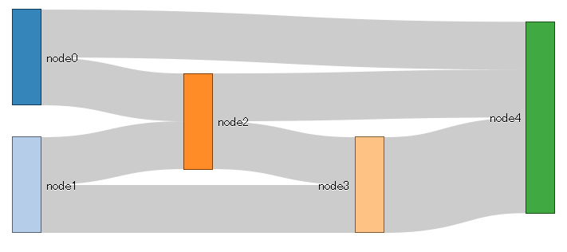
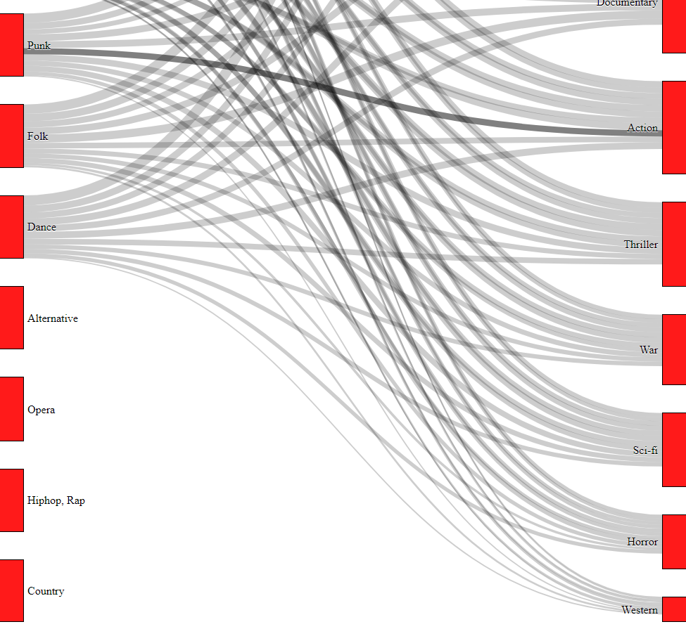
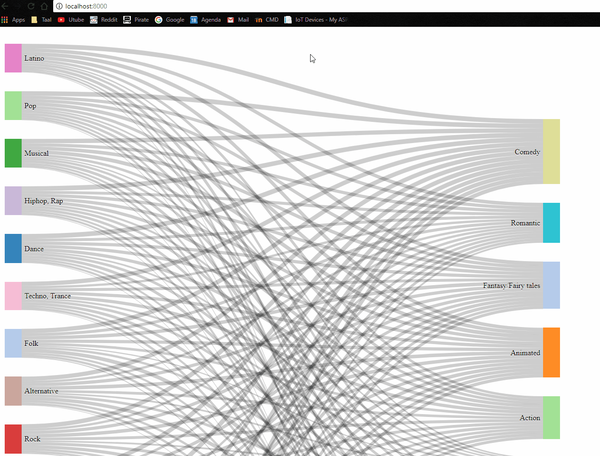
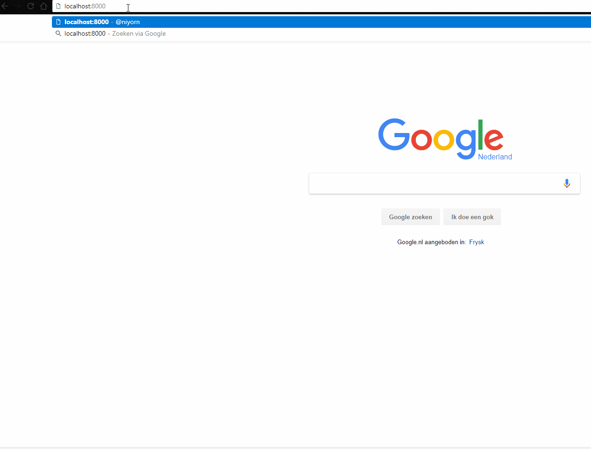
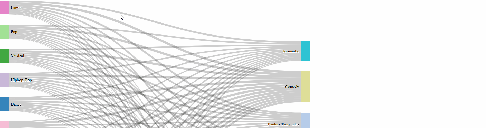
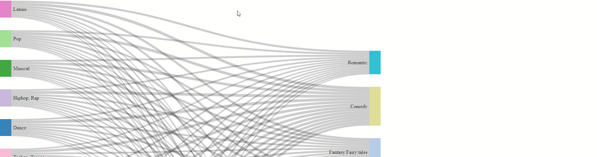
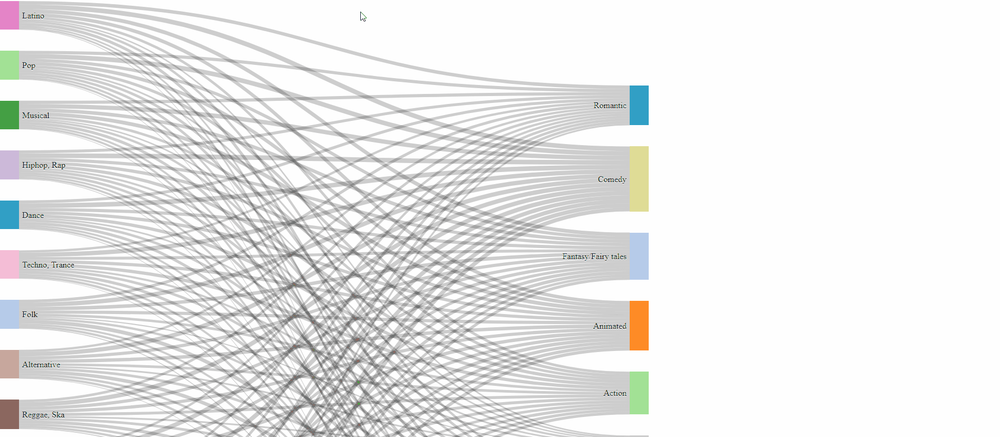

This diagram shows the relationship between the music genre that people listen to and the movie genre they watch.
The lines of the sankey diagram show genre relationship with each other. The thickness indicates the amount.
At the bar chart are the names of the movie genre on the y axis. The x-axis indicates the amount (in percentage).

##Data src
The data was taken from here
Link to src: https://www.kaggle.com/miroslavsabo/young-people-survey
Download link: https://www.kaggle.com/miroslavsabo/young-people-survey/data

An example of the data
Music | Slow songs or fast songs | Dance | Folk | Country | Classical music
-- | -- | -- | -- | -- | --
5 | 3 | 2 | 1 | 2 | 2
4 | 4 | 2 | 1 | 1 | 1
5 | 5 | 2 | 2 | 3 | 4
5 | 3 | 2 | 1 | 1 | 1
5 | 3 | 4 | 3 | 2 | 4
5 | 3 | 2 | 3 | 2 | 3
5 | 5 | 5 | 3 | 1 | 2
5 | 3 | 3 | 2 | 1 | 2
5 | 3 | 3 | 1 | 1 | 2
5 | 3 | 2 | 5 | 2 | 2
5 | 3 | 3 | 2 | 1 | 2
5 | 3 | 1 | 1 | 1 | 4
5 | 3 | 1 | 2 | 1 | 4
5 | 3 | 5 | 3 | 2 | 1

1 = disagree disgaree 5 = totally agree

## Proces

The first thing I did was download the source file of the sanky plugin. From this source it will create this sanky.


To get the the graph working we need to format our dataset to a dataset that looks a little bit like this:
```
{
"nodes":[
{"node":0,"name":"node0"},
{"node":1,"name":"node1"},
{"node":2,"name":"node2"},
{"node":3,"name":"node3"},
{"node":4,"name":"node4"}
],
"links":[
{"source":0,"target":2,"value":2},
{"source":1,"target":2,"value":2},
{"source":1,"target":3,"value":2},
{"source":0,"target":4,"value":2},
{"source":2,"target":3,"value":2},
{"source":2,"target":4,"value":2},
{"source":3,"target":4,"value":4}
]}
```
The 'nodes' are the blocks.
And the links cooordinate which nodes needs to connect with each other.

### The sankey Graph
First of all I created an array that saved all the music genre that there is in the dataset;
From there I created a function that search for all the people that like specific genre.
The function looks like this:
```javascript
//All the music genre that are in the dataset
var allMusicGenre = ['Dance', 'Folk', 'Country', 'Classical music', 'Musical', 'Pop', 'Rock', 'Metal or Hardrock', 'Punk', 'Hiphop, Rap', 'Reggae, Ska', 'Swing,  Jazz', "Rock 'n Roll", 'Alternative', 'Latino', 'Techno, Trance', 'Opera'];

var nestData = [];

allMusicGenre.forEach(function(musicGenre) {
  let music = {};
  let total = 0;
  let like = 3;
  let allPosition = [];
  var value =[];

  data.forEach(function(d, position) {
    if (d[musicGenre] > like) {
      allPosition.push(position);
      total++;
    };
  });

  music.value = value;
  music.musicGenre = musicGenre;
  music.total = total;
  nestData.push(music)
});
```
This function will give this result:
```
0: {value: Array(11), musicGenre: "Dance", total: 376}
1: {value: Array(11), musicGenre: "Folk", total: 144}
2:{value: Array(11), musicGenre: "Country", total: 118}
3 etc
```

From there we want to know how many of these people like a specific genre.
This function will do just that:
```javascript
allMovieGenre.forEach(function(movieGenre){
  let movieValue = {};
  let movieTotal = 0;
  allPosition.forEach(function(position){
      if(data[position][movieGenre] > like){
        movieTotal++;
      }
  });
  movieValue.movieGenre = movieGenre;
  movieValue.total = movieTotal;
  value.push(movieValue);
});
```
And from that we got this as result;
```
musicGenre:"Dance"
total:376
value: Array(11)
0:{movieGenre: "Horror", total: 139}
1:{movieGenre: "Thriller", total: 203}
2:{movieGenre: "Comedy", total: 343}
3:{movieGenre: "Romantic", total: 214}
4:{movieGenre: "Sci-fi", total: 149}
5 etc
```
Ok now that we have that, lets look at sankey function again and look how it want its data presented. src: https://stackoverflow.com/questions/14629853/json-representation-for-d3-force-directed-networks.
```javascript
sankey
  .nodes(sankeyData.nodes)
  .links(sankeyData.links)
  .layout(32);
```
If we look at that function, we can see it wants a 'source', a 'target' and a 'value'.
In our nestData we all have this information. We will create a function that get all the 'source' and value;
The function looks like this:
```javascript
//Format data to sankey
var nodes = [];
var links = [];
var sankyData = {nodes, links};

nestData.forEach(function(d){
  var total = d.movieTotal;
  d.value.forEach(function(data){
    let linkObject = {};
    linkObject.source = d.musicGenre;
    linkObject.target = data.movieGenre;
    linkObject.value = Math.round(data.total/d.movieTotal*100);//calculate the percentage
    links.push(linkObject)
  });
});
```

that will give us this:
```
1:{source: "Dance", target: "Thriller", value: 9}
2:{source: "Dance", target: "Comedy", value: 16}
3:{source: "Dance", target: "Romantic", value: 10}
4:{source: "Dance", target: "Sci-fi", value: 7}
5:{source: "Dance", target: "War", value: 7}
6:{source: "Dance", target: "Fantasy/Fairy tales", value: 11}
7:{source: "Dance", target: "Animated", value: 11}
8:{source: "Dance", target: "Documentary", value: 10}
9:{source: "Dance", target: "Western", value: 2}
10:{source: "Dance", target: "Action", value: 11}
etc
```
/Value is in percentage/

Getting all the name (object) is simple because we already have an array that  saved all  name of the music genre and movie genre;
```javascript
var nodes = [];
//Get all nodes
  allMusicGenre.forEach(function(d){
    nodes.push(d);
  });
  allMovieGenre.forEach(function(d){
    nodes.push(d);
  });
```
From there we saved all data data that we have in an objects
```javascript
var sankyData = {nodes, links};
```
This object contains all the 'nodes', 'source', 'target' and 'value';

Ok now we will add the 'sankeyData' object to the sankey function like this:

```javascript
sankey
  .nodes(sankeyData.nodes)
  .links(sankeyData.links)
  .layout(32);
```

If we refresh the browser, the browser will give this error:
```
Uncaught TypeError: Cannot read property 'push' of undefined
```
Why is that?

After searching on the web why it doesnt work, I stumble on the solution:
First of all why I doesn't work:

If we look at the sankey function, it is searching for the index, a number value. Like this:

```
{
"nodes":[
{"node":0,"name":"node0"},
{"node":1,"name":"node1"},
{"node":2,"name":"node2"},
{"node":3,"name":"node3"},
{"node":4,"name":"node4"}
],
"links":[
{"source":0,"target":2,"value":2},
{"source":1,"target":2,"value":2},
{"source":1,"target":3,"value":2},
{"source":0,"target":4,"value":2},
{"source":2,"target":3,"value":2},
{"source":2,"target":4,"value":2},
{"source":3,"target":4,"value":4}
]}
```
Here you can see that the source and target correspont with the index of the nodes.  Instead what we have on those places are the name.
So we need to change the name to the index of the nodes.

This little piece of code will do just that for us:
```javascript
var nodeMap = {};
 sankeyData.nodes.forEach(function(x) { nodeMap[x.name] = x; });
 sankeyData.links = sankeyData.links.map(function(x) {
 return {
 source: nodeMap[x.source],
 target: nodeMap[x.target],
 value: x.value
 };
 });
```
this solution comes from stackoverflow https://stackoverflow.com/questions/14629853/json-representation-for-d3-force-directed-networks

Ok now we will refresh the browser again
It will represent us with this:

That more like it!

Still why are nodes without lines?
If we look at the console it give us this error:/
```
Error: <path> attribute d: Expected number, "…58505670447 490,NaN 944,NaN".
```
So it gets something that is not a number.

If we log the 'nestData' we can see why that is.

```
11:{value: Array(11), musicGenre: "Swing,  Jazz", total: 0, movieTotal: 0}
12:{value: Array(11), musicGenre: "Rock 'n Roll", total: 0, movieTotal: 0}
```
some value are zero. So we need to create a function that fillter this out.
After long digging  I cant come up with a solution. So I just delete it out of the array :)

So lets refresh the page again.

It works!!!

Now lets add different color to the nodes, so we can differentiate them.
This was created by d3noob from here: https://bl.ocks.org/d3noob/013054e8d7807dff76247b81b0e29030;
First lets add a variable color.
```javascript
  var color = d3.scaleOrdinal(d3.schemeCategory20);
```
And in the rect lets add a function that calls the color.
```javascript
// add the rectangles for the nodes
node.append("rect")
  .attr("height", function(d) {
    return d.dy;
  })
  .attr("width", sankey.nodeWidth())
  .style("fill", function(d) {
    return d.color = color(d.name.replace(/ .*/, "")); })//<---here
  .append("title")
  .text(function(d) {
    return d.name + "\n" + format(d.value);
  });
  ```
  now lets see what we have


Still that's a lot of Nodes. Lets make it that if you  click on a Node. lets say for example 'Pop', all the other nodes will disapear and you will only have one node left.

First lets add an ID and a click Handler to the nodes, so we know which nodes we've clicked on.
```javascript
node.append("rect")
  .attr("height", function(d) {
    return d.dy;
  })
  .attr("width", sankey.nodeWidth())
  .attr('id', function(d){//<--here
    return d.name
  })
  .on('click', showOneData)//<--and here
  .style("fill", function(d) {
    return d.color = color(d.name.replace(/ .*/, "")); })
  .append("title")
  .text(function(d) {
    return d.name + "\n" + format(d.value);
  });
```

From there we're going to write a function that redraw the graph but with only one object in an array. The array contains the ID.
```javascript
var allMusicGenre = [genre];//Genre contains the name of the id
```
Lets see what we have

Very nice!

Ok lets make it a little bit nice and at a transition to it.

I created this function that draw the lines
```javascript
//this is added to the link object to create a white space
.attr("stroke-dashoffset", "1870")
.attr("stroke-dasharray", "1870")
```
```javascript
//transition function
function transition() {
     var path = d3.selectAll('.link');
     path
          .transition()
          .duration(4000)
          .attr("stroke-dashoffset", "0");
}
```
Now lets see the product



## The making of the bar chart
By the making of the bar chat I created a new javascript file. This is done to keep the code organized, or else we dont know which code is which anymore.

The first thing I did was getting the height and width of the div container, so we can set our range
```javascript
//this will be our range
widthBar = d3.select('.bar-chart-container').node();
widthBar = widthBar.getBoundingClientRect().width; //get width of container
heightBar = d3.select('.bar-chart-container').node();
heightBar = heightBar.getBoundingClientRect().height; //get width of container
```
From there we add this to the svg
```javascript
//The svg to draw the bar chart in
var svgBar = d3.select(".bar-chart-container").append('svg'),
  margin = {
    top: 20,
    right: 20,
    bottom: 30,
    left: 40
  },
  width = +widthBar - margin.left - margin.right,
  height = +heightBar - margin.top - margin.bottom;

var groups = svgBar.append('g')
  .attr("transform", "translate(" + margin.left + "," + margin.top + ")");;
```

From there we're going to add the x and y axis.
We want to make a horizontal barchart so the y-axis is ordinal and the x is linear
We can also set the domain and range because we already know that from 'SankeyData'
```javascript
//y Scale
var yAs = d3.scaleBand()
     .range([0, height])
     .paddingInner(0.3)
     .domain(data.map(
          function(d) {
               return d.name
          }
     ));

//x Scale
var xAs = d3.scaleLinear()
     .range([0, width])
     .domain([0, d3.max(data, function(d) {
          return d.value;
     })]);
     //create the x-as
     g.append('g')
          .attr('class', 'axis axis--y')
          .call(d3.axisLeft(yAs));

     //create the y-as
     g.append('g')
          .attr('class', 'axis axis--x')
          .call(d3.axisBottom(xAs))
          .attr('transform', 'translate(0,' + height + ')');     
     ```
     

Ok the bar chart is there, but without any bar. So lets add that to it.
```javascript
//binding
var rect = g.append('g').selectAll('rect').data(data);
//This will be the underweight bar
rect.enter()
     .append('rect')
     .attr('class', 'bar')
     .attr('x', '0')
     .attr('y', function(d){
         return yAs(d.name);
     })
    .attr('width', function(d){
        return xAs(d.value);
    })
    .attr('height', yAs.bandwidth());
```
Now lets see it again
 
 Very nice!  But why does it not fill the whole space.
 After a long of digging, I've found the solution.
In my css I gave the the bar chart container a display of flex and because of that it doesn't get the full width but the full height;

```css
.bar-chart-container{
    display: inline-flex;
    width: 35vw;
    height: 40vh;
}
```
We need to change the direction of the container so it get the full width. So lets and Flex-direction: column;
```css
.bar-chart-container{
    display: inline-flex;
    flex-direction: column;
    width: 35vw;
    height: 40vh;
}
```
After that lets also add a fill color that correspont with the nodes.
Lets see that again

